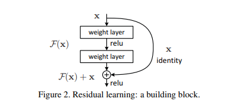
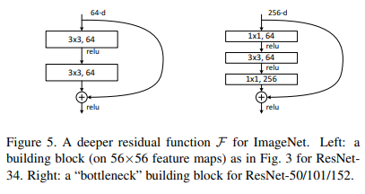
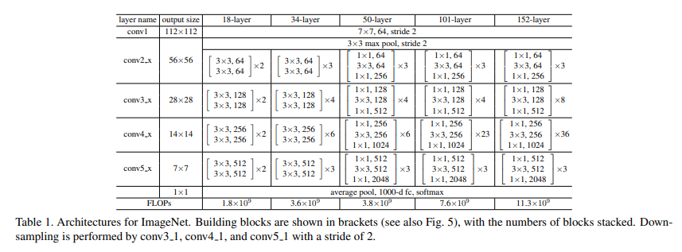

# 🗻 ResNet50 PyTorch Implementation

This repository contains a replication of **ResNet50 (Deep Residual Learning for Image Recognition)** using PyTorch. The goal is to reproduce the **ResNet50 architecture** with bottleneck blocks for ImageNet classification.

- Only **ResNet50** has been implemented.  
- Architecture follows **Conv1 → Conv2_x → Conv3_x → Conv4_x → Conv5_x → Pool → Flatten → FC** sequence.  
**Paper**: [Deep Residual Learning for Image Recognition (CVPR 2016)](https://arxiv.org/abs/1512.03385)

> 🛠️ Users may need to adjust the code slightly to implement other ResNet variants (like ResNet18, ResNet34, or ResNet101) or custom architectures.
---

## 🏗 Project Structure

```bash
ResNet50-Replicating/
│
├── src/
│   ├── layers/
│   │   ├── conv1.py             # Initial 7x7 Conv + BN + ReLU
│   │   ├── conv2_x.py           # Conv2 bottleneck blocks
│   │   ├── conv3_x.py           # Conv3 bottleneck blocks
│   │   ├── conv4_x.py           # Conv4 bottleneck blocks
│   │   ├── conv5_x.py           # Conv5 bottleneck blocks
│   │   ├── pool_layers/
│   │   │   ├── maxpool_layer.py # MaxPool2d after Conv1
│   │   │   └── avgpool_layer.py # Global Average Pooling after Conv5
│   │   ├── flatten_layer.py     # Conv → FC transition
│   │   └── fc_layer.py          # Fully Connected Layer (1000 classes)
│   │
│   ├── model/
│   │   └── resnet50.py          # Conv1 → Conv2_x → Conv3_x → Conv4_x → Conv5_x → Pool → Flatten → FC
│   │
│   └── config.py                # Hyperparameters, optimizer
│
├── requirements.txt
└── README.md
```

---

## 〽️ Figures

### Figure 2 – Residual Connections
  
- Shows how shortcut connections bypass convolutional layers, allowing the input to be directly added to the output. This helps gradients flow smoothly in very deep networks and stabilizes training. Residual connections make it easier to learn identity mappings if needed.

### Figure 5 – Bottleneck Block
  
- Illustrates the 1×1 → 3×3 → 1×1 convolution sequence used in deeper ResNets like ResNet‑50. The first 1×1 reduces channels, the 3×3 processes features, and the last 1×1 restores channels. This design reduces parameters while keeping network depth.

### Table 1 – ResNet Variants
  
- Lists ResNet models (18, 34, 50, 101, 152) and their layer configurations. Shows how many bottleneck blocks each stage contains and where strides change. Helps compare depth and complexity across different variants.

---

## 🔗 Feedback

For questions or feedback, contact: [barkin.adiguzel@gmail.com](mailto:barkin.adiguzel@gmail.com)


